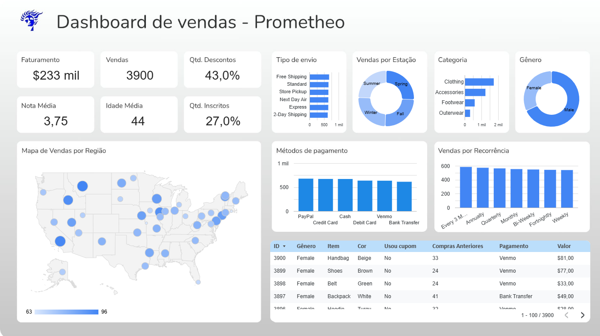

# Sales Dashboard – Prometheo (Looker)

## Objective
Provide a comprehensive overview of sales performance, customer demographics, and product trends to support data-driven decision-making.

## Tools Used
- Looker
- Excel
- Python

## Key Metrics
- **Revenue**
- **Total Sales** 
- **Discount Rate** 
- **Average Rating** 
- **Average Customer Age** 
- **Subscription Rate** 

## Dashboard Highlights

- **Sales by Region:** Interactive map showing sales distribution across the US.
- **Sales by Season:** Donut chart visualizing sales volume by season (Summer, Spring, Fall, Winter).
- **Product Categories:** Bar chart of sales by product category (Clothing, Accessories, Footwear, Outerwear).
- **Customer Gender:** Gender distribution of customers.
- **Shipping Methods:** Breakdown of shipping types used.
- **Payment Methods:** Bar chart of payment methods (PayPal, Credit Card, Cash, Debit Card, Venmo, Bank Transfer).
- **Recurring Sales:** Analysis of sales by recurrence (e.g., monthly, quarterly).
- **Customer Table:** Detailed table with customer info, purchase history, coupon usage, and payment details.

## Insights & Recommendations

- **High Discount Usage:** 43% of sales involve discounts, indicating strong price sensitivity.
- **Subscription Opportunity:** With 27% of customers subscribed, there is room to grow recurring revenue.
- **Regional Focus:** Certain regions show higher sales density; consider targeted marketing.
- **Popular Categories:** Clothing leads in sales; explore cross-selling with Accessories and Footwear.
- **Payment Preferences:** Diverse payment methods are used; ensure all options remain available.

## How to Use This Dashboard
1. **Filter by Region, Category, or Time Period** to analyze specific segments.
2. **Monitor KPIs** at the top for a quick performance overview.
3. **Explore Visualizations** to identify trends and outliers.
4. **Leverage Insights** for strategic planning and operational improvements.

## Dashboard Preview
[View Dashboard Online](https://lookerstudio.google.com/reporting/486efdae-3325-4f42-9f2d-169fcea2114e)

